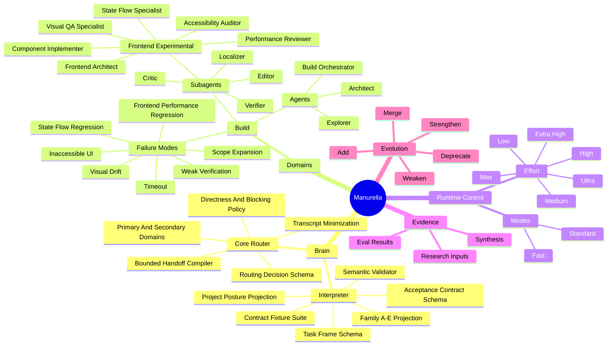

# Manurella Cognitive Graph Mind Map



## Reading The Map

- Domains own agents and constraints.
- Agents delegate only through explicit graph edges.
- Modes change workflow shape.
- Effort changes reasoning depth.
- Evals strengthen or weaken graph edges.
- Failure modes must be linked to mitigations.

## V0 Focus

The first mature slice should be:

```text
Build -> frontend work -> specialist topology -> verification -> eval feedback
```

This slice is intentionally not complete yet. The graph should grow from evaluated behavior, not from speculative completeness.

## Current Depth-First Slice

The connected Interpreter-to-Core checkpoint is active:

```text
Interpreter
-> Trusted Input Envelope
-> Trust Partitioner
-> Task Frame Parser Baseline
-> Task Frame schema
-> Acceptance Contract Compiler
-> Acceptance Contract schema
-> Parser Benchmark Corpus
-> Model Candidate Evaluator
-> semantic validator
-> Family and project-posture projection
-> representative positive and negative fixtures
-> Core routing decision
-> bounded handoff projection
```

The deterministic input-to-Core path, parser evaluation harness, repeated-run promotion gate, shadow adapter, inference-only compiler, blinded benchmark, guarded inference mode, representative replay evaluator, and privacy-bounded live observation recorder are implemented. Blinded StepFun v1 passed two independent runs: 26/37 and 29/37 critical fields, both with 100% schema, semantic, routing, and safety validity. Guarded representative replay selected 12/12 candidates across both promoted captures with no fallback, proving the mechanism but not live-runtime readiness. Shadow remains the default. The next connected checkpoint is collecting independently captured guarded live observations and completing human residual-risk review before researching any default-activation threshold.

The Phase 3 Brain runtime-state slice now compiles validated Interpreter/Core artifacts into separate task, world, user, self, uncertainty, and capability state; a volatile active workspace; and a bounded context packet. The compiler excludes transcript and untrusted payload fields and treats v0 budgets as transparent regression baselines. The next depth-first Brain slice is observation-driven revision, strategy selection, verification, bounded repair, and stopping.

Observation-driven revision, v0 strategy selection, external-verification handling, bounded repair, repeated-failure/stall replanning, unsafe/budget stops, and untrusted-observation quarantine are now executable. Governed stops remain resumable `blocked` state. The remaining Phase 3 slice is the execution/recovery packet boundary that carries these decisions into Phase 5 Core runtime work.

Phase 3's execution/recovery boundary is now implemented. Brain control decisions compile into runtime-neutral packets whose action ceiling comes from checked-in agent permissions rather than inferred tools; blocked capabilities are explicit, and recovery resumes from workspace/artifact checkpoints. Phase 3 is complete at v0. The next depth-first branch is Phase 4 durable memory and Framework Atlas evidence flow.

Phase 4 is complete at v0. Claim-structured proposals pass deterministic trust, conflict, permission, review, support, and benchmark gates; separate idempotent writers apply reviewed memory and narrow Atlas mutations. Retrieval filters expiry, overdue review, lifecycle, scope, principal, type, limits, and contradictory claims into an auditable bounded packet. Atlas application supports only existing lifecycle and repository evidence changes, validates candidates before atomic replacement, and cannot add, delete, merge, or rewire graph entities. The next depth-first branch is Phase 5 Core runtime and adapter integration.

Phase 5's first slice is implemented. Trusted task intake now compiles end to end through Interpreter, Core routing, Brain workspace/control, principal-filtered memory retrieval, and permission-bounded operation policy into one runtime-neutral session bundle. The bundle excludes raw transcript and reasoning fields, marks provider/native controls as unenforced, and performs no runtime side effect. Integration also corrected permission semantics so `ask` actions remain blocked and normalized the obsolete `sentient` effort label to canonical `extra-high`. The next slice is Kilo operation-packet projection and validation.

Phase 5's Kilo projection slice is implemented from two compared research reports and a conservative official-source synthesis. Runtime sessions project into per-session `.kilo/agents/` definitions plus suggested interactive argv without invoking a model. Only sufficiently bounded `allow` capabilities survive; `ask`, `deny`, generic edit/shell/browser authority, external directories, todo tools, autonomous flags, native effort mapping, direct packet ingestion, and stable JSON-result claims remain denied or unsupported. The next slice is typed execution-observation ingestion.

Phase 5's execution-observation slice is implemented. Normalized adapter captures now validate exact session/packet/projection lineage, lifecycle and timeout consistency, typed verification, observed artifacts, stream digests, and model-output digests. Raw events and model text never enter Brain observations. Direct capture files cannot self-assert runtime trust: unattested claims become model-inferred no-change events with no evidence or recovery authority. Adapter-attested upstream-idle timeout produces an explicit recovery signal anchored to the existing checkpoint.

Phase 5's recovery/resume integration is implemented. A typed recovery compiler consumes the checkpoint Brain workspace, prior runtime session, prior deterministic Kilo projection, and execution-observation bundle; rejects non-recovery, unattested, and tampered-lineage cases; advances Brain into `stop_blocked`; compiles a read-only `recovery` operation packet; and projects the next Kilo runtime session without execution.

Phase 5's adapter-evidence boundary is implemented. A typed evidence compiler validates the checkpoint workspace, runtime session, deterministic Kilo projection, normalized capture, execution observation, and optional recovery result as one privacy-bounded chain. It rejects projection substitution and unknown model metadata by default, stores raw streams/model output only by digest, and covers accepted completion, timeout recovery, unattested no-change, tamper rejection, and unknown-model rejection fixtures. The next Phase 5 slice is live Kilo evidence capture plus result records.

## Experimental Frontend Slice

The frontend nodes are draft graph candidates only. They are not accepted agents, not exported runtime agents, and not official routing targets until benchmark evidence supports promotion.
