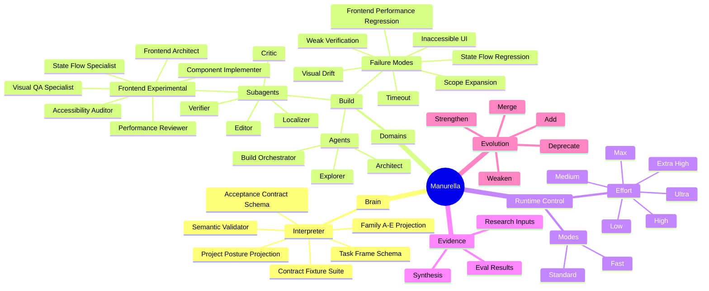

# Manurella Cognitive Graph Mind Map



## Reading The Map

- Domains own agents and constraints.
- Agents delegate only through explicit graph edges.
- Modes change workflow shape.
- Effort changes reasoning depth.
- Evals strengthen or weaken graph edges.
- Failure modes must be linked to mitigations.

## V0 Focus

The first mature slice should be:

```text
Build -> frontend work -> specialist topology -> verification -> eval feedback
```

This slice is intentionally not complete yet. The graph should grow from evaluated behavior, not from speculative completeness.

## Current Depth-First Slice

The first executable Brain checkpoint is active:

```text
Interpreter
-> Task Frame schema
-> Acceptance Contract schema
-> semantic validator
-> Family and project-posture projection
-> representative positive and negative fixtures
```

Natural-language parsing, Router consumption, handoff compilation, and runtime execution remain later connected checkpoints.

## Experimental Frontend Slice

The frontend nodes are draft graph candidates only. They are not accepted agents, not exported runtime agents, and not official routing targets until benchmark evidence supports promotion.
